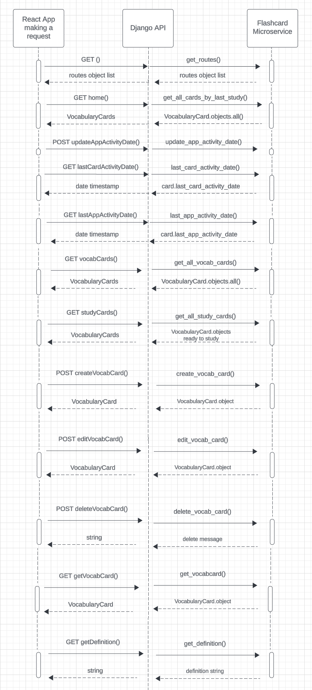

# Communication Contract for Microservice

This README serves as a communication contract for the microservice. It provides clear instructions on how to programmatically request and receive data from the microservice.

### Endpoints
```markdown
1. `""` (GET): This endpoint is used to get all routes. It is handled by the `get_routes` function in the views.

2. `"home/"` (GET): This endpoint is used to get all cards by the last study. It is handled by the `get_all_cards_by_last_study` function in the views.

3. `"home/update/update_app_activity_date/"` (POST): This endpoint is used to update the app activity date. It is handled by the `update_app_activity_date` function in the views.

4. `"home/last_card_activity_date/"` (GET): This endpoint is used to get the last card activity date. It is handled by the `last_card_activity_date` function in the views.

5. `"home/last_app_activity_date/"` (GET): This endpoint is used to get the last app activity date. It is handled by the `last_app_activity_date` function in the views.

6. `"vocabcards/"` (GET): This endpoint is used to get all vocab cards. It is handled by the `get_all_vocabcards` function in the views.

7. `"studycards/"` (GET): This endpoint is used to get all study cards. It is handled by the `get_all_studycards` function in the views.

8. `"vocabcards/create/"` (POST): This endpoint is used to create a new vocab card. It is handled by the `create_vocabCard` function in the views.

9. `"vocabcard/<str:primary_key>/edit/"` (PUT): This endpoint is used to edit a vocab card. The `primary_key` in the URL is used to identify the vocab card. It is handled by the `edit_vocab_card` function in the views.

10. `"vocabcard/<str:primary_key>/delete/"` (DELETE): This endpoint is used to delete a vocab card. The `primary_key` in the URL is used to identify the vocab card. It is handled by the `delete_vocab_card` function in the views.

11. `"vocabcard/<str:primary_key>/"` (GET): This endpoint is used to get a specific vocab card. The `primary_key` in the URL is used to identify the vocab card. It is handled by the `get_vocabcard` function in the views.

12. `"definition/<str:primary_key>/"` (GET): This endpoint is used to get a definition. The `primary_key` in the URL is used to identify the definition. It is handled by the `get_definition` function in the views.

```

## How to run the Microservice

1. Change directory to  ./django-backend-nihongo-flashcards/nihongo_flashcards

2. Within the terminal, run the following installation commands:
- Install python
- `pip install django`
- `pip install djangorestframework`
- `pip install django-cors-headers` (supports Django communicating with React)
- `pip install beautifulsoup4` (Use for web scraping)

3. TO run the microservice, run `python manage.py runserver` in the terminal. The server will run on 'http://127.0.0.1:8000'

## How to REQUEST Data

To request data from the microservice, you will need to make HTTP requests to the appropriate endpoints. Here is an example of how to make a GET request to the `"/home/"` endpoint using JavaScript's `fetch` API:

```javascript
fetch('http:/127.0.0.1:8000/home/')
  .then(response => response.json())
  .then(data => console.log(data));
```
In this example, 'http://127.0.0.1:8000' is with the URL of the microservice server set by Django. The "/home/" endpoint is used to get all cards by the last study.

For endpoints that require a POST or PUT request, you will need to send data in the body of the request. Here is an example of how to make a POST request to the "/vocabcards/create/" endpoint:

```javascript
const data = {
    'vocab_card': 'aberration',
    'definition': 'A departure from what is normal, usual, or expected, typically an unwelcome one.'
};

fetch('http:/127.0.0.1:8000/vocabcards/create/', {
  method: 'POST',
  headers: {
    'Content-Type': 'application/json',
  },
  body: JSON.stringify(data),
})
.then(response => response.json())
.then(data => console.log(data));
```

In this example, the data object contains the data to be sent to the microservice.


## How to RECEIVE Data

When you make a request to the microservice, it will return a response. This response contains the data you requested. Here is an example of how to receive and print this data:

```javascript
fetch('http:/127.0.0.1:8000/vocabcards/')
  .then(response => response.json())
  .then(data => console.log(data));
```

In this example, the response.json() method is used to convert the response data to a JavaScript object. This object can then be used to access the data you requested.

The actual structure of the data will depend on the specific endpoint you are requesting from. Refer to the endpoint descriptions in this README for more information on what data each endpoint returns.


## UML Sequence Diagram


